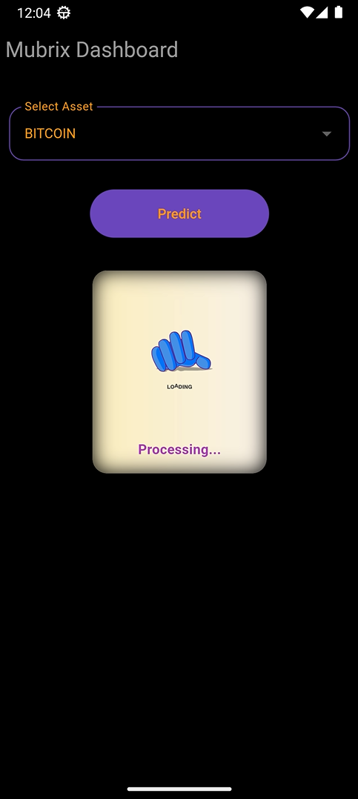
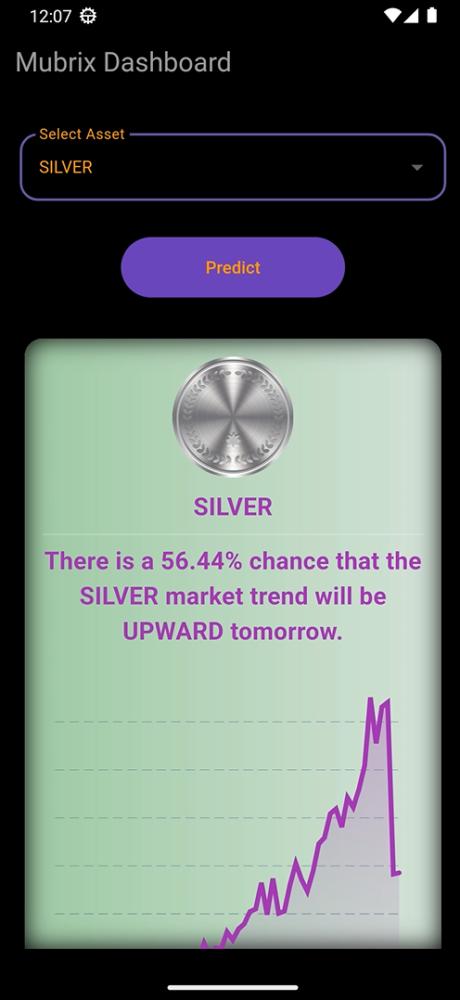

# Mubrix: Your AI-Powered Market Compass (End-to-End Project) 

**Mubrix** is an end-to-end decision-making engine designed to bridge the gap between complex market data and actionable trading insights. By leveraging machine learning, Mubrix provides trend predictions for 6 major assets (including Gold, Silver, and Bitcoin), helping traders navigate volatility with confidence and also Andriod App.

---

## App Showcase

| App Launcher | Welcome / Intro | Prediction Input | Prediction Result
| :---: | :---: | :---: | :---: |
|  |  |  |  |

---

---


| News Feed | Asset Selection | Prediction Result
| :---: | :---: | :---: |
|  |  |  |

---

## Key Features
- Trend Prediction: Instant UP/DOWN signals for 6 major assets using optimized ML models.
- Confidence Scoring: Provides a probability-based confidence score for every prediction.
- Deep Visualization: Integrated 90-day historical trend analysis.
- Real-time :  latest market news.
- Multi-Platform Access: Available via a Streamlit Web App and Android Application(Flutter).

---

## Tech Stack
- Machine Learning: Python, Scikit-learn, Pandas (EDA & Modeling)
- MLOps: DVC (Data Version Control) for pipeline automation and reproducibility.
- Backend: FastAPI (Centralized API serving).
- Frontend: Streamlit (Web Dashboard) & Flutter (Android Mobile App).
- Storage: Git LFS & DVC for large-scale data and model tracking.

---

## Repository Structure
- **📂 1_Data:** Contains raw data.
- **📂 2_Python_EDA:** Detailed Jupyter notebooks for exploratory data analysis and initial experiments.
- **📂 4_model_comparison:** Performance metrics and comparative analysis of different ML architectures.
- **📂 5_Full_Project_Draft_DVC:** The Core Pipeline. Contains the dvc.yaml file to automate the entire workflow from data to model.
- **📂 6_Common_API:** The centralized FastAPI backend that handles feature processing and model inference.
- **📂 7_Streamlit_Web_App:** A professional web interface for real-time market visualization.
- **📂 8_Android_App:** A Flutter-based mobile application for on-the-go trading signals.
- **9_Short_Video.webm**
- **10_Detail_Video.mp4**
---

## Execution Guide

### 1. Reproducing the ML Pipeline (DVC)

```bash
cd 5_Full_Project_Draft_DVC
pip install dvc
# Automatically runs data cleaning, engineering, and training stages
dvc repro
```

### 2. Launching the Backend API
```bash
cd 6_Common_API
# Install required dependencies
pip install -r requirements.txt

# First OF All Extract the Today Features
python features.py

# Start the FastAPI server
uvicorn API-main:app --reload
```


### 3. Deploying the Frontends

##### You can interact with the Mubrix engine via two platforms:

#### 1. Web Interface (Streamlit): 
```bash
cd 7_Streamlit_Web_App
streamlit run FrontEnd.py

```
#### 2. Mobile Interface (Flutter):
```bash
cd 8_Android_App
flutter pub get
flutter run
```

## The Pipeline Workflow

- Ingestion: Raw market data is pulled and versioned via DVC.
- DVC Automation: dvc repro executes the stages defined in dvc.yaml, ensuring the model is always trained on the latest validated data.
- Feature Serving: features.py inside the Common API folder transforms incoming user data into model-ready tensors.
- Inference: API-main.py serves the model via RESTful endpoints.
- Multi-Platform Access: The Streamlit and Flutter apps consume these endpoints to provide real-time UP/DOWN signals and confidence scores.


## System Note:

- The API must be active in the background for both the Web and Mobile applications to function correctly.
